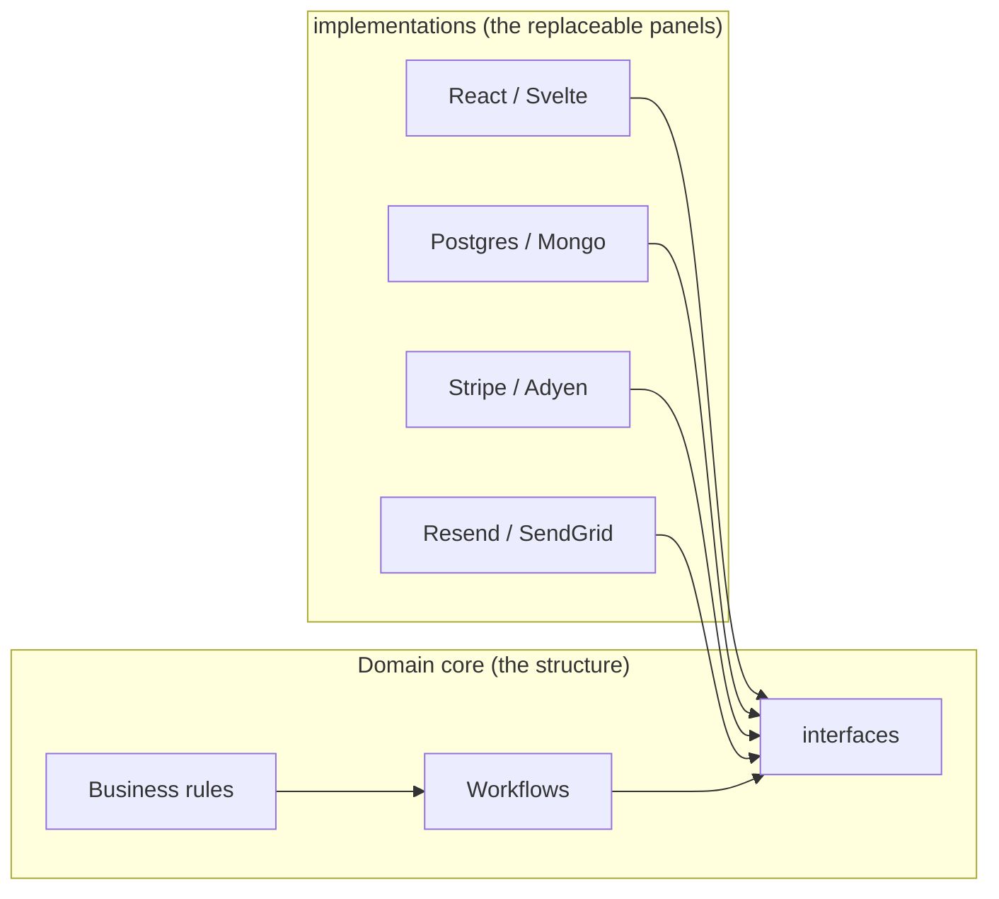
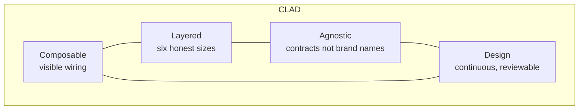
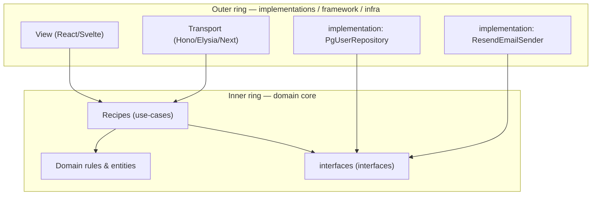
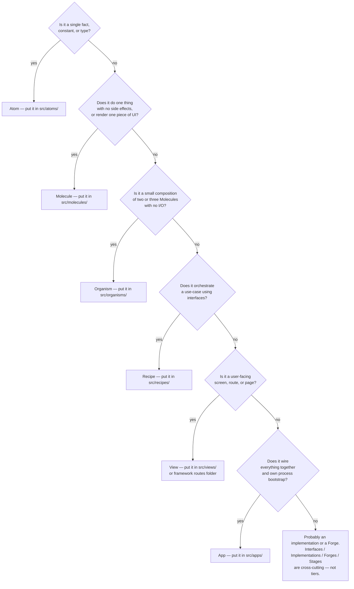
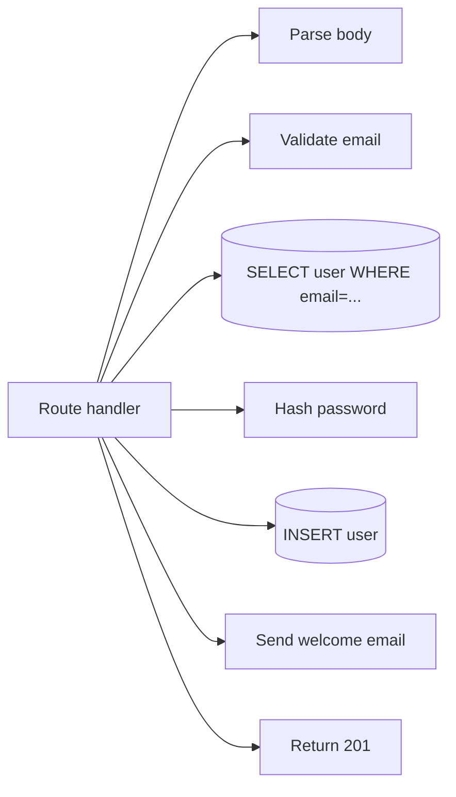
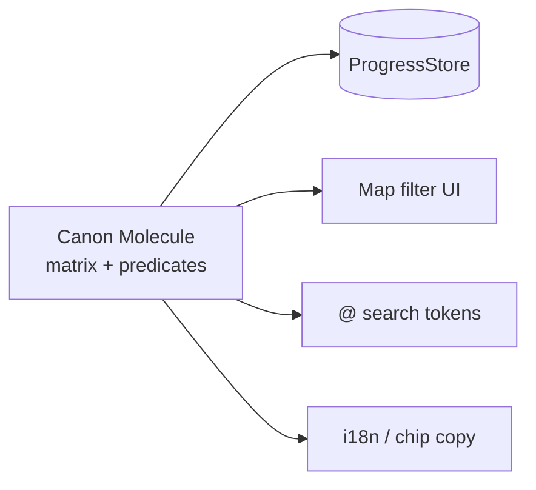

# CLAD — Composable Layered Agnostic Design

> Software architecture for full-stack web apps that an intern can read, a senior can defend in code review, and a refactor cannot quietly poison.

---

## TL;DR (read this first)

CLAD is a vocabulary for shaping full-stack web applications so each piece is small, named, replaceable, and obvious.

It rests on four ideas:

1. **Composable** — bigger behaviour is always smaller pieces wired together through visible contracts, never hidden globals.
2. **Layered** — units come in six understood sizes (Atom → Molecule → Organism → Recipe → View → App) and you can tell at a glance which size you are reading.
3. **Agnostic** — the rules of your product never name a specific database, framework, or vendor; specifics live in replaceable outer panels.
4. **Design** — a continuous discipline carried in naming, reviews, and ADRs (architecture decision records), not a one-time blueprint.

The name picks up the **cladding** metaphor from architecture: a stable structural core wrapped in **replaceable panels** that handle weather, fashion, and the latest tool. Swap the panels; the building stands.

CLAD is **advisory**. It is a shared way of talking — not a linter, not a gate. Your team still decides.

---

## Who this document is for

This document is written for **two readers at once**.

**If you are new to engineering** — perhaps a product manager, designer, QA analyst, founder, or someone learning to ship — every dense paragraph is preceded by a one-liner marked **"In plain terms"**. A glossary right below defines every piece of jargon before it is used. You can skip the code if you like; the prose tells the story.

**If you have shipped production systems for years** — the heuristics, code samples, dependency diagrams, and testing patterns are the shared shape CLAD adds to your existing toolbelt. Skim past the plain-English hooks, lean into the examples and the **Influences & Attribution** map at the end.

The best-designed systems are the ones everyone on the team can read, review, and change without fear. Both audiences matter equally.

---

## A note on voice

> *A wise mentor does not hand you a manual. They ask the question that makes the answer obvious.*

When the AI in this workspace teaches CLAD, it sounds a little like Merlin in the old animated films — playful metaphors, zero mockery, modern engineering rigor underneath. During incidents, security work, or data loss risk, **the persona drops**: facts and recovery first.

---

## The cooking metaphor

The tier names — Atom, Molecule, Organism, Recipe, View, App — map onto something most readers already understand: **a working kitchen**. The metaphor is deliberately loose. An Atom can appear on its own, blended into a Molecule, or composed into an Organism; the tier is about **size and intent**, not about how deeply a unit is nested.

| Tier | In the kitchen | In your code |
|------|---------------|--------------|
| **Atom** | A pinch of salt. A tablespoon of olive oil. "Salmon must be cooked to 60&nbsp;°C." | A constant, an enum value, a tiny type — a single named fact. |
| **Molecule** | A spice rub. A vinaigrette. A piece of *mise en place* — one tiny prep that does one thing. | A pure function, one component, one schema. Owns one promise. |
| **Organism** | A bechamel. A bread dough. A sub-preparation with its own identity, reusable across dishes. | A small composition of Molecules wired with intent — a feature hook, a workflow. |
| **Recipe** | The dish itself — *lasagna*, *focaccia*, *cassoulet*. Lists ingredients **by role** ("flour", "olive oil"), not by brand. | One use case end-to-end. Orchestrates Molecules and Organisms; asks the world for what it needs through Interfaces. |
| **View** | The plate. The takeaway box. The food-truck window. Same dish, different surface. | The surface humans or integrators touch — a page, a route handler, a CLI command, a webhook. |
| **App** | The kitchen / restaurant. Picks *which* oven, *which* supplier, *which* brand of flour fills each role. | The deployable. Wires concrete Implementations into the Interfaces the Recipe asked for. |
| **Interface** | A line on the shopping list: "flour", "milk". The role, not the brand. | A named contract the Recipe depends on; many providers can satisfy it. |
| **Implementation** | The specific bag of King Arthur Bread Flour the kitchen actually bought this week. | The concrete provider — a Postgres client, an in-memory fake, a fetch-based adapter. |
| **Forge** | The prep station / the wholesale supplier who hands the kitchen pre-cut ingredients on request. | A factory or builder that constructs wired Implementations on demand. |
| **Stage** | The service period — *lunch service*, *dinner service*, *Sunday brunch*. Same kitchen, different parameters. | The runtime environment — *dev*, *staging*, *prod* — that changes which Implementations get bound. |

**A pinch of salt** (Atom) can flavour a vinaigrette (Molecule), enrich a dough (Organism), or be sprinkled straight onto the finished dish (Recipe). Where the Atom *appears* in the call tree is unrelated to its tier; the tier captures **what kind of thing it is**.

> **Why the metaphor matters:** kitchens already separate "what is on the shopping list" from "which brand we bought today" from "how the plate is set down in front of the diner". Reviewers and product partners who never opened the codebase can talk about Recipes, Views, and Implementations using the same nouns engineers use, without translation.

---

## Glossary — read this once

> Every word in this table is used elsewhere in the document. If a term feels unfamiliar later, scroll back here.

| Term | Plain definition | Engineering equivalent |
|------|-----------------|------------------------|
| **CLAD** | The philosophy this document describes. | "Composable Layered Agnostic Design." |
| **The CLAD Stack** | The six layered sizes a unit can be (Atom → App). | Granularity hierarchy. |
| **Atom** | The smallest useful piece — one fact, one constant, one helper. | Primitive, utility, type alias. |
| **Molecule** | A single-purpose unit: one component, one function, one schema. | SRP unit / "atom." |
| **Organism** | A small composition of Molecules wired with intent. | Composite component / "molecule." |
| **Recipe** | A use-case or workflow — one capability the product offers. | Application service, command/query handler. |
| **View** | A user-facing surface — a screen, route, or page. | View, "template/page" in some hierarchies. |
| **App** | The full system: the deployed app. | Application, deployment unit. |
| **Interface** | The inward-facing contract a tier exposes — a named promise. Hexagonal Architecture calls this a **port**. | Port. |
| **Implementation** | A concrete fulfilment of an Interface. Hexagonal Architecture calls this an **adapter**. | Adapter. |
| **Forge** | The construction patterns that build wired units. | Factory, builder, DI container. |
| **Stage** | The environment an App runs in. | dev / staging / prod configuration. |
| **ADR** | A short note recording why a non-obvious decision was made. | Architecture Decision Record. |
| **TDD** | Writing the test first so the design emerges from the contract. | Test-Driven Development. Prefer `test(...)` over `it(...)`. |
| **JSDoc** | Comment-as-contract: parameter docs, return types, custom tags. | Used here for `@traceId`, `@description`, `@owner`, etc. |
| **Trace ID** | A short ID that ties a test back to a requirement in `requirements-registry.yaml`. | The registry is the source of truth. |
| **Canon Molecule** | The one module that defines what a status, filter, or token *means* for every surface that must stay aligned. | A Molecule exporting a **table-driven catalog** (rows of ids + linked fields) and **pure predicates** derived from those rows — no framework or storage imports. |
| **Projection layer** | A thin module that turns canon ids into labels, UI copy, or parse wiring — without redefining meaning. | Adapter Molecules (i18n labels, chip headlines, search parse glue) that **map** catalog entries; they do not own parallel allowlists or predicates. |
| **Composition root** | The single place where every dependency is wired together. | `app.ts`, server bootstrap, DI container factory. |

---

## Why CLAD exists: the problem it solves

### The symptom most teams recognise

Picture an app that started as a tidy SPA with three API routes. Six months and four features later:

- The checkout screen imports from `utils/`, `api/`, `hooks/`, **and** the database client.
- Changing a discount rule touches seven files across three directories.
- The test suite is missing, or it mounts half the app to render one button.
- Replacing the payment provider means a project-wide string-literal hunt.

This is not a team failure. **It is a vocabulary failure.** No one agreed on where boundaries should be or how to name them, so boundaries dissolved under deadline pressure.

### What CLAD provides

CLAD gives the team a **shared vocabulary of shapes** — names for the kinds of units that exist in every full-stack web application, guidance for where each lives, and signals for when a boundary is being crossed by accident. It is **not** a framework. It is **not** a folder convention to copy. It is a way of *talking* about code so the talking translates into reviews, refactors, and onboarding.

> **In plain terms:** CLAD is a shared map legend. Once everyone on the team agrees what "Atom," "interface," and "Recipe" mean on *your* map, you can give each other directions without a full tour every time.

---

## The cladding metaphor (one minute, one diagram)

The buildings in your city probably look stable from the outside, but the **panels you see** — the bricks, the glass, the metal sheets — are almost always replaceable cladding. Behind them sits a structural skeleton that does not move when fashion or weather changes.



*Implementations fulfill interfaces. The core does not know which implementation is in use today.*

The core never imports the cladding. The cladding imports the core. When you change a vendor — switch payment providers, swap email senders, migrate from Postgres to a planet-scale store — you replace an implementation, not the building.

---

## The four CLAD pillars in depth

CLAD rests on four ideas. They reinforce each other; weakening one weakens the rest.



### Pillar 1 — Composable

**Larger things are smaller things wired together through visible contracts.**

> **In plain terms:** Imagine building with labelled pluggable cables. Every cable has a connector you can see. The alternative — wires soldered inside a sealed box — works until you need to replace one. Then you take everything apart.

Composition in CLAD means dependencies flow in through **named parameters, props, or injected constructors** — never through global variables, module-level singletons reached via import, or shared mutable state.

❌ **Hidden dependency** — function reaches into a module-level global:

```typescript
import { db } from '../infra/db.js';

export async function getUserById(id: string) {
  return db.query('SELECT * FROM users WHERE id = $1', [id]);
}
```

You cannot test this without a real database. The signature does not even hint that a database is involved.

✅ **Composable** — dependency arrives via a named interface:

```typescript
import type { UserRepository } from '../sockets/UserRepository.js';

export async function getUserById(
  id: string,
  users: UserRepository,
): Promise<User | null> {
  return users.findById(id);
}
```

In tests, pass an in-memory implementation. In production, pass the Postgres implementation. The signature documents the dependency completely.

### Pillar 2 — Layered

**Every unit fits one of six named sizes. You can tell which one you are reading without checking the import graph.**

> **In plain terms:** Imagine furniture sizes — screws, hinges, drawers, cabinets, rooms, houses. A factory does not call a drawer a hinge. CLAD names the sizes for code: Atom, Molecule, Organism, Recipe, View, App.

The **CLAD Stack** (smallest → largest):

| Tier | One-line job | Examples |
|------|--------------|----------|
| **Atom** | One fact. | A constant, a TypeScript type, a primitive helper like `clamp`. |
| **Molecule** | One single-purpose unit. | A function, a component, a schema, a single route handler. |
| **Organism** | A small composition of Molecules. | A labeled input, a validated form section, a composed hook. |
| **Recipe** | A use-case. | `registerUser`, `placeOrder`, `processWebhook`. |
| **View** | A user-facing surface. | A page, a screen, a top-level route. |
| **App** | The whole system. | The deployable app, the composition root. |

A reader who knows the stack can guess the size and behaviour of `Atom.MIN_CHARGE_CENTS`, `Molecule.MoneyDisplay`, `Organism.LabeledInput`, `Recipe.placeOrder`, `View.CheckoutPage`, and `App.createApp` from the names alone.

### Pillar 3 — Agnostic

**The core rules of your product do not know which database, framework, or vendor you are using today.**

> **In plain terms:** The rules of your business — "a discount cannot exceed 50% of the order total," "a user must verify their email before placing an order" — are facts about your product, not facts about React or Postgres. If you can only find those rules by searching framework files, they are in the wrong place.

The dependency direction is fixed: outward depends inward, never the reverse.



*Arrows point inward. The core never imports the outer ring.*

### Pillar 4 — Design (as a verb)

**Design is something you do continuously, not something that happens once before coding.**

> **In plain terms:** Good architecture is not a blueprint you draw on day one and follow forever. It is the habit of asking "does this still make sense?" every time you touch the code. CLAD provides the vocabulary that habit needs.

Design in CLAD shows up as:

- **Naming units** so a reader who was not there when the code was written can tell what each unit does.
- **Writing ADRs** when a non-obvious decision is made (`docs/decisions/`).
- **Adding JSDoc** to every Molecule and Recipe so the contract is readable without opening the implementation.
- **Making the wrong shape feel awkward** — if smuggling a database call into a View requires fighting types or crossing three folders, most engineers pause and ask "should I really do this?"
- **Canon review before merge** — when a change touches filters, badges, `@` search tokens, or persistence flags, ask: *Is there already a Canon Molecule? If we add a second allowlist, should we extend the canon instead?*

---

## The CLAD Stack — six tiers with code

A guided tour of every tier, with a paired **frontend** and **backend** example so both sides of a full-stack app see themselves in the same vocabulary.

### Tier 1 — Atom (one fact)

An Atom holds a single fact: a constant, a type, a primitive helper. It almost never changes; when it does, it changes for a single reason.

**Frontend Atom — a brand-agnostic colour token**

```typescript
// src/atoms/tokens.ts
export const SPACE_UNIT_PX = 8;
export const RADIUS_SM_PX = 4;
export const Z_INDEX_OVERLAY = 1000;
```

**Backend Atom — a business minimum**

```typescript
// src/atoms/limits.ts
/**
 * @description Minimum chargeable amount. Below this, payment providers
 * reject as a micro-transaction and we never want to attempt it.
 * @traceId BR-001
 */
export const MIN_CHARGE_CENTS = 100;
```

**Test for an Atom** (yes, even a constant earns a test when it encodes a business decision):

```typescript
import { MIN_CHARGE_CENTS } from './limits.js';

test('[BR-001] minimum charge stays at one dollar so PSPs accept it', () => {
  expect(MIN_CHARGE_CENTS).toBe(100);
});
```

### Tier 2 — Molecule (one single-purpose unit)

A Molecule is the workhorse: one function, one component, one schema, one tiny route handler. It has one promise it keeps. Its name does not contain the word "And."

**Frontend Molecule — a presentational component**

```tsx
// src/molecules/MoneyDisplay.tsx
import type { FC } from 'react';

interface MoneyDisplayProps {
  /** Integer cents. Avoids floating-point currency drift. */
  cents: number;
  /** ISO 4217 currency code; defaults to USD. */
  currency?: string;
}

/**
 * Renders a monetary value localised for the current user.
 * @example <MoneyDisplay cents={1999} /> -> "$19.99"
 */
export const MoneyDisplay: FC<MoneyDisplayProps> = ({ cents, currency = 'USD' }) => {
  const formatted = new Intl.NumberFormat(undefined, {
    style: 'currency',
    currency,
    minimumFractionDigits: 2,
  }).format(cents / 100);

  return <span className="money">{formatted}</span>;
};
```

**Frontend Molecule — Svelte equivalent**

```svelte
<!-- src/molecules/MoneyDisplay.svelte -->
<script lang="ts">
  let { cents, currency = 'USD' }: { cents: number; currency?: string } = $props();

  const formatted = $derived(
    new Intl.NumberFormat(undefined, {
      style: 'currency',
      currency,
      minimumFractionDigits: 2,
    }).format(cents / 100),
  );
</script>

<span class="money">{formatted}</span>
```

**Backend Molecule — a pure validation function**

```typescript
// src/molecules/validatePaymentBody.ts
/**
 * Validates a raw payment request body.
 * @traceId FR-001
 */
export function validatePaymentBody(body: unknown): { cardToken: string; amountCents: number } {
  if (!body || typeof body !== 'object') throw new TypeError('body must be an object');
  const { cardToken, amountCents } = body as Record<string, unknown>;
  if (typeof cardToken !== 'string' || cardToken.length === 0)
    throw new TypeError('cardToken must be a non-empty string');
  if (typeof amountCents !== 'number' || !Number.isInteger(amountCents))
    throw new TypeError('amountCents must be an integer');
  return { cardToken, amountCents };
}
```

**TDD for the Molecule above — write these first:**

```typescript
import { validatePaymentBody } from './validatePaymentBody.js';

test('[FR-001] accepts a well-formed payment body', () => {
  expect(validatePaymentBody({ cardToken: 'tok_abc', amountCents: 500 }))
    .toEqual({ cardToken: 'tok_abc', amountCents: 500 });
});

test('[FR-001] rejects a missing cardToken', () => {
  expect(() => validatePaymentBody({ amountCents: 500 })).toThrow(TypeError);
});

test('[FR-001] rejects a non-integer amount', () => {
  expect(() => validatePaymentBody({ cardToken: 'tok_abc', amountCents: 5.5 })).toThrow(TypeError);
});
```

#### Cross-surface policy catalogs (Canon Molecules)

> **In plain terms:** When "Discovered" on a map footer, `@visited` in search, and a gathering-log section must always mean the same thing, put the **meanings** in one Molecule — not three sticky notes that drift apart.

A **Canon Molecule** is still a Molecule (one job: own this domain's cross-surface policy). It holds a **declarative matrix** — usually an array of records with stable ids and linked fields (map filter mode, search token aliases, storage normalization rules) — plus **pure functions** that answer questions like "does this marker count as Ready?" Every other tier **projects** from that matrix.

**Promote to a Canon Molecule when two or more are true:**

1. The same logical enum or matrix appears in **two or more tiers** (store, filter UI, search, labels, counts, E2E seeds).
2. Changing one row should **automatically** imply changes elsewhere (aliases, allowlists, predicates).
3. You have already copy-pasted an allowlist, alias map, or "counts as X" helper once.

**Stay at Atom + small Molecules when:** one constant and one consumer; YAGNI says a second surface is not credible soon.

**Naming:** `*Catalog.ts`, `*Policy.ts`, or `*Matrix.ts` under `src/molecules/` — not `utils/constants.ts`. See [Canon Molecules — full section](#canon-molecules--one-matrix-many-projections) for projection layers, tests, and anti-patterns.

### Tier 3 — Organism (small composition)

An Organism is two or three Molecules wired together with a small amount of intent. It is the size where most teams accidentally invent god-objects; CLAD keeps Organisms honest by reminding you they are still small.

**Frontend Organism — a labeled, validated input**

```tsx
// src/organisms/LabeledMoneyInput.tsx
import { useId } from 'react';
import type { FC } from 'react';
import { MoneyDisplay } from '../molecules/MoneyDisplay.js';

interface LabeledMoneyInputProps {
  label: string;
  cents: number;
  onChange: (next: number) => void;
  errorText?: string;
}

/**
 * A label + numeric input + live MoneyDisplay preview, wired together.
 */
export const LabeledMoneyInput: FC<LabeledMoneyInputProps> = ({
  label, cents, onChange, errorText,
}) => {
  const id = useId();
  return (
    <div className="field">
      <label htmlFor={id}>{label}</label>
      <input
        id={id}
        type="number"
        value={(cents / 100).toFixed(2)}
        aria-invalid={Boolean(errorText)}
        aria-describedby={errorText ? `${id}-err` : undefined}
        onChange={(e) => onChange(Math.round(parseFloat(e.target.value) * 100))}
      />
      <MoneyDisplay cents={cents} />
      {errorText && <p id={`${id}-err`} role="alert">{errorText}</p>}
    </div>
  );
};
```

**Backend Organism — composed validators**

```typescript
// src/organisms/parsePaymentRequest.ts
import { validatePaymentBody } from '../molecules/validatePaymentBody.js';
import { assertChargeAboveMinimum } from '../molecules/assertChargeAboveMinimum.js';

/**
 * Parses and validates a payment request end-to-end.
 * @traceId FR-001
 */
export function parsePaymentRequest(body: unknown) {
  const parsed = validatePaymentBody(body);
  assertChargeAboveMinimum(parsed.amountCents);
  return parsed;
}
```

An Organism still has one named purpose. If it grows past three Molecules or starts orchestrating side effects, promote it to a Recipe.

### Tier 4 — Recipe (use-case)

A Recipe is a single capability the product offers: register a user, place an order, run a webhook. Recipes orchestrate Molecules and Organisms through interfaces — they never reach into implementations directly.

**Backend Recipe — `registerUser`**

```typescript
// src/recipes/registerUser.ts
import { Email } from '../molecules/Email.js';
import { User } from '../molecules/User.js';
import type { UserRepository } from '../sockets/UserRepository.js';
import type { EmailSender } from '../sockets/EmailSender.js';
import type { Clock } from '../sockets/Clock.js';
import { randomUUID } from 'node:crypto';

interface RegisterUserInput { email: string; displayName: string }
type RegisterUserResult = { ok: true; user: User } | { ok: false; error: string };

/**
 * Recipe: registers a user and dispatches a welcome email.
 *
 * @traceId FR-003
 * @description Authentication is delegated to the identity provider (ADR-004);
 * we never store passwords here.
 */
export async function registerUser(
  input: RegisterUserInput,
  users: UserRepository,
  emails: EmailSender,
  clock: Clock,
): Promise<RegisterUserResult> {
  const emailResult = Email.parse(input.email);
  if (!emailResult.ok) return { ok: false, error: emailResult.error };

  const existing = await users.findByEmail(emailResult.value.toString());
  if (existing) return { ok: false, error: 'Email already registered' };

  const user = new User({
    id: randomUUID(),
    email: emailResult.value.toString(),
    displayName: input.displayName,
    createdAt: clock.now(),
  });

  await users.save(user);
  await emails.send({
    to: user.email,
    subject: 'Welcome',
    body: `Hi ${user.displayName}, welcome aboard.`,
  });

  return { ok: true, user };
}
```

**Recipe test using in-memory implementations — zero mocking framework:**

```typescript
import { registerUser } from './registerUser.js';
import { InMemoryUserRepository } from '../plugs/memory/InMemoryUserRepository.js';
import { InMemoryEmailSender } from '../plugs/memory/InMemoryEmailSender.js';
import { FixedClock } from '../plugs/memory/FixedClock.js';

test('[FR-003] registers a new user and queues a welcome email', async () => {
  const users = new InMemoryUserRepository();
  const emails = new InMemoryEmailSender();
  const clock = new FixedClock(new Date('2026-05-13T00:00:00Z'));

  const result = await registerUser(
    { email: 'sam@example.com', displayName: 'Sam' },
    users, emails, clock,
  );

  expect(result.ok).toBe(true);
  expect(emails.sent).toHaveLength(1);
  expect(emails.sent[0].to).toBe('sam@example.com');
});

test('[FR-003] rejects an email that is already registered', async () => {
  const users = new InMemoryUserRepository().seed([
    new User({ id: 'u1', email: 'sam@example.com', displayName: 'Sam', createdAt: new Date() }),
  ]);
  const emails = new InMemoryEmailSender();
  const clock = new FixedClock(new Date());

  const result = await registerUser(
    { email: 'sam@example.com', displayName: 'Sam' },
    users, emails, clock,
  );

  expect(result).toEqual({ ok: false, error: 'Email already registered' });
});
```

### Tier 5 — View (user-facing surface)

A View is a screen — a page, a route, a wizard step. It composes Organisms and Molecules and asks Recipes for data and behaviour through hooks, loaders, or actions. A View never inlines SQL, never talks to vendors, never holds business rules.

**Frontend View — React (Next.js App Router)**

```tsx
// src/views/CheckoutPage.tsx
import { CheckoutSummary } from '../organisms/CheckoutSummary.js';
import { PayButton } from '../organisms/PayButton.js';
import { Spinner } from '../molecules/Spinner.js';
import { useCheckoutSummary } from '../organisms/useCheckoutSummary.js';

/**
 * View: the checkout screen.
 * @traceId BR-001
 */
export function CheckoutPage() {
  const { items, total, isLoading, error } = useCheckoutSummary();

  if (isLoading) return <Spinner label="Loading your cart…" />;
  if (error) return <p role="alert">{error}</p>;
  if (!items || !total) return null;

  return (
    <main aria-label="Checkout">
      <CheckoutSummary items={items} total={total} />
      <PayButton total={total} />
    </main>
  );
}
```

**Frontend View — Svelte (`+page.svelte`)**

```svelte
<!-- src/routes/checkout/+page.svelte -->
<script lang="ts">
  import CheckoutSummary from '$lib/organisms/CheckoutSummary.svelte';
  import PayButton from '$lib/organisms/PayButton.svelte';
  import Spinner from '$lib/molecules/Spinner.svelte';

  let { data } = $props();
  $: ({ summary, error } = data);
</script>

{#if error}
  <p role="alert">{error}</p>
{:else if !summary}
  <Spinner label="Loading your cart…" />
{:else}
  <main aria-label="Checkout">
    <CheckoutSummary items={summary.items} total={summary.total} />
    <PayButton total={summary.total} />
  </main>
{/if}
```

### Tier 6 — App (whole system)

An App is the deployable app. It owns exactly one job: the **composition root** — wire every implementation into every interface, instantiate Recipes, mount Views, listen on a port. The App is the only place the words `new Stripe(...)`, `new Pool(...)`, or `process.env.STRIPE_KEY` appear.

**Backend App — Hono composition root**

```typescript
// src/apps/createApp.ts
import { Hono } from 'hono';
import { Pool } from 'pg';
import Stripe from 'stripe';
import { PgUserRepository } from '../plugs/postgres/PgUserRepository.js';
import { StripePaymentGateway } from '../plugs/stripe/StripePaymentGateway.js';
import { ResendEmailSender } from '../plugs/resend/ResendEmailSender.js';
import { SystemClock } from '../plugs/SystemClock.js';
import { registerUserRoute } from '../molecules/registerUserRoute.js';
import type { AppEnv } from './AppEnv.js';

export function createApp(env: NodeJS.ProcessEnv): Hono<AppEnv> {
  const pool = new Pool({ connectionString: env.DATABASE_URL });
  const stripe = new Stripe(env.STRIPE_SECRET_KEY!);

  const app = new Hono<AppEnv>();

  app.use('*', async (c, next) => {
    c.set('users', new PgUserRepository(pool));
    c.set('payment', new StripePaymentGateway(stripe));
    c.set('emails', new ResendEmailSender(env.RESEND_API_KEY!));
    c.set('clock', new SystemClock());
    await next();
  });

  registerUserRoute(app);
  return app;
}
```

In tests, the App swaps every implementation for an in-memory equivalent. The Recipes, Molecules, and Atoms never notice.

---

## Cross-cutting concepts: interfaces, implementations, Forges, Stages

These four ideas apply at every tier of the CLAD Stack. They are not tiers themselves — they are the seams that make the tiers swappable.

### Interface (the named promise)

An interface — what Hexagonal Architecture calls a **port** — is a contract that names what a tier needs without naming who provides it.

```typescript
// src/sockets/UserRepository.ts
import type { User } from '../molecules/User.js';

/** interface: everything the application needs to persist and retrieve users. */
export interface UserRepository {
  findById(id: string): Promise<User | null>;
  findByEmail(email: string): Promise<User | null>;
  save(user: User): Promise<void>;
  delete(id: string): Promise<void>;
}
```

Notice what is **not** here: no SQL, no ORM, no mention of Postgres or MongoDB.

### Implementation (the concrete provider)

An implementation — what Hexagonal Architecture calls an **adapter** — is a class or function that fulfills an interface using a specific technology.

```typescript
// src/plugs/postgres/PgUserRepository.ts
import type { Pool } from 'pg';
import type { UserRepository } from '../../sockets/UserRepository.js';
import type { User } from '../../molecules/User.js';

export class PgUserRepository implements UserRepository {
  constructor(private readonly pool: Pool) {}

  async findById(id: string): Promise<User | null> {
    const { rows } = await this.pool.query<User>(
      'SELECT id, email, display_name, created_at FROM users WHERE id = $1',
      [id],
    );
    return rows[0] ?? null;
  }

  async findByEmail(email: string): Promise<User | null> {
    const { rows } = await this.pool.query<User>(
      'SELECT id, email, display_name, created_at FROM users WHERE email = $1',
      [email],
    );
    return rows[0] ?? null;
  }

  async save(user: User): Promise<void> {
    await this.pool.query(
      `INSERT INTO users (id, email, display_name, created_at)
       VALUES ($1, $2, $3, $4)
       ON CONFLICT (id) DO UPDATE SET email = $2, display_name = $3`,
      [user.id, user.email, user.displayName, user.createdAt],
    );
  }

  async delete(id: string): Promise<void> {
    await this.pool.query('DELETE FROM users WHERE id = $1', [id]);
  }
}
```

**An in-memory implementation** is its companion, written before the production implementation:

```typescript
// src/plugs/memory/InMemoryUserRepository.ts
import type { UserRepository } from '../../sockets/UserRepository.js';
import type { User } from '../../molecules/User.js';

export class InMemoryUserRepository implements UserRepository {
  private readonly store = new Map<string, User>();

  seed(users: User[]): this {
    users.forEach((u) => this.store.set(u.id, u));
    return this;
  }

  async findById(id: string) { return this.store.get(id) ?? null; }
  async findByEmail(email: string) {
    return [...this.store.values()].find((u) => u.email === email) ?? null;
  }
  async save(user: User) { this.store.set(user.id, user); }
  async delete(id: string) { this.store.delete(id); }
}
```

### Forge (construction patterns)

A Forge is *where wiring happens* — a factory, a builder, or a small DI helper that assembles a wired object. Forges live near the App, never inside Recipes or Molecules.

```typescript
// src/apps/forges/repositories.ts
import { Pool } from 'pg';
import type { UserRepository } from '../../sockets/UserRepository.js';
import { PgUserRepository } from '../../plugs/postgres/PgUserRepository.js';
import { InMemoryUserRepository } from '../../plugs/memory/InMemoryUserRepository.js';

export function forgeUserRepository(
  mode: 'memory' | 'postgres',
  cfg: { databaseUrl?: string },
): UserRepository {
  if (mode === 'memory') return new InMemoryUserRepository();
  return new PgUserRepository(new Pool({ connectionString: cfg.databaseUrl }));
}
```

### Stage (environment boundary)

A Stage encapsulates *which world the App is running in*: dev, staging, prod, CI. Stages select Forges; they do not contain business rules.

```typescript
// src/apps/stage.ts
export interface Stage {
  readonly name: 'dev' | 'staging' | 'prod' | 'test';
  readonly databaseUrl: string;
  readonly stripeKey: string;
  readonly logLevel: 'debug' | 'info' | 'warn' | 'error';
}

export function readStageFromEnv(env: NodeJS.ProcessEnv): Stage {
  const name = (env.NODE_ENV ?? 'dev') as Stage['name'];
  return {
    name,
    databaseUrl: env.DATABASE_URL ?? '',
    stripeKey: env.STRIPE_SECRET_KEY ?? '',
    logLevel: (env.LOG_LEVEL as Stage['logLevel']) ?? 'info',
  };
}
```

---

## Decision flowchart: which tier does this code belong to?

> A pocket guide for code reviews. When in doubt, walk this chart.



---

## Directory structure

A CLAD-shaped project is navigable by **tier**, not by file type.

```
my-app/
│
├── src/
│   ├── atoms/                ← Tier 1: single facts
│   │   ├── tokens.ts
│   │   └── limits.ts
│   │
│   ├── molecules/               ← Tier 2: single-purpose units
│   │   ├── MoneyDisplay.tsx
│   │   ├── validatePaymentBody.ts
│   │   ├── Email.ts
│   │   └── User.ts
│   │
│   ├── organisms/                ← Tier 3: small compositions
│   │   ├── LabeledMoneyInput.tsx
│   │   ├── CheckoutSummary.tsx
│   │   └── parsePaymentRequest.ts
│   │
│   ├── recipes/              ← Tier 4: use-cases
│   │   ├── registerUser.ts
│   │   ├── placeOrder.ts
│   │   └── processWebhook.ts
│   │
│   ├── views/               ← Tier 5: screens / routes
│   │   ├── CheckoutPage.tsx
│   │   └── DashboardPage.tsx
│   │
│   ├── sockets/              ← Cross-cutting: contracts (interfaces only)
│   │   ├── UserRepository.ts
│   │   ├── PaymentGateway.ts
│   │   ├── EmailSender.ts
│   │   └── Clock.ts
│   │
│   ├── plugs/                ← Cross-cutting: concrete implementations
│   │   ├── postgres/
│   │   │   └── PgUserRepository.ts
│   │   ├── stripe/
│   │   │   └── StripePaymentGateway.ts
│   │   ├── resend/
│   │   │   └── ResendEmailSender.ts
│   │   └── memory/           ← in-memory implementations for testing
│   │       ├── InMemoryUserRepository.ts
│   │       ├── InMemoryEmailSender.ts
│   │       └── FixedClock.ts
│   │
│   └── apps/               ← Tier 6: composition root
│       ├── createApp.ts
│       ├── stage.ts
│       └── forges/
│           └── repositories.ts
│
├── requirements-registry.yaml
├── .traceability.yaml
├── docs/
│   ├── philosophy/clad.md
│   ├── traceability/
│   └── decisions/            ← ADRs
└── package.json
```

> **Note for senior engineers:** mapping CLAD onto Hexagonal Architecture's "ports & adapters" terminology, `sockets/` ≈ ports, `plugs/` ≈ adapters, `recipes/` ≈ application services, `apps/` ≈ composition root, `views/` ≈ delivery mechanism. The tier vocabulary is *additionally* size-aware: Atoms / Molecules / Organisms are granular distinctions that the Hexagonal name set leaves unsaid.

---

## Anti-patterns: shapes CLAD is designed to prevent

### 1. Fat controller



A single route handler does parsing, validation, business rules, database work, and email dispatch. You cannot test the email-already-exists check without a running database. Replacing the email provider means digging through the route handler.

**Correction:** push validation into a Molecule, the business rule into an Atom/Molecule, persistence into an implementation behind an interface, and orchestration into a Recipe. The route handler stays a Molecule that does **only** parse → call Recipe → map result to HTTP.

### 2. God context / god store

```tsx
// ❌ one React context holds everything
const AppContext = createContext({
  user: null, cart: [], orders: [], checkoutStatus: 'idle',
  discountCode: null, paymentMethods: [], notifications: [],
  featureFlags: {}, setUser: () => {}, addToCart: () => {},
  /* ... fifteen more setters ... */
});
```

Any consumer of this context re-renders when **any** field changes. Boundaries collapse into a single state monolith.

**Correction:** one context per concern — `AuthContext`, `CartStore`, `NotificationStore`. Each is an Organism with a clear name and a tiny surface.

### 3. Leaky import (View reaches into an implementation)

```tsx
// ❌ a React View imports infra directly
import { db } from '../../plugs/postgres/db.js';

export function AdminPage({ userId }: { userId: string }) {
  const [user, setUser] = useState(null);
  useEffect(() => {
    db.query('SELECT * FROM users WHERE id = $1', [userId]).then(setUser);
  }, [userId]);
  return <UserProfile user={user} />;
}
```

The View now depends on the database driver. Deploying the front-end requires the Postgres client. Tests need a database.

**Correction:** data fetching lives in an Organism hook (`useUser`) that calls a Molecule route or, on the server, a Recipe via an interface. The View renders what it is handed.

### 4. Util junk drawer

```
src/utils/
├── helpers.ts        ← 800 lines of unrelated functions
├── misc.ts           ← date formatting + API calls + sanitisation
├── constants.ts      ← feature flags + UI strings + DB ids
└── types.ts          ← types from every layer
```

If you cannot name a folder after what its contents *do*, it is probably a junk drawer.

**Correction:** name by domain concern. `atoms/limits.ts`, `atoms/tokens.ts`, `molecules/Email.ts`. The CLAD Stack already gives you the folders.

### 5. Anaemic interface (interface that exposes raw SQL)

```typescript
// ❌ interface that leaks SQL into the interface
export interface UserRepository {
  rawQuery(sql: string, params: unknown[]): Promise<unknown[]>;
}
```

This is an interface in name only. Callers must know SQL; switching to MongoDB means changing every caller.

**Correction:** the interface exposes domain verbs (`findById`, `findByEmail`, `save`), not the storage language.

### 6. Scatter matrix (parallel sources of truth)

**Looks like:** `MAP_FILTER_MODES`, `SEARCH_INDICATOR_ALLOWLIST`, and `visited` counting logic live in three files. Labels in i18n-only modules. Updating "Discovered" requires an archaeology sprint.

**Correction:** one **Canon Molecule** with a table-driven catalog; map filters, search tokens, storage normalization, and counts **derive** from the same rows. Everything else is a **projection layer** (labels, chip copy, parse wiring) that imports the canon — it does not redefine meaning.

### 7. Compat shim graveyard

**Looks like:** `@deprecated` re-exports, barrels that exist "so old imports keep working," renamed modules left as thin aliases indefinitely.

**Correction:** migrate callers in the **same PR** that introduces the canon; delete shims. If a breaking rename must land in steps, record an **ADR** with a removal date — shims are not a CLAD tier and are not a default migration strategy.

---

## Canon Molecules — one matrix, many projections

> **In plain terms:** Trace IDs in `requirements-registry.yaml` say *what the product must do*. A Canon Molecule says *how we classify entities* so every surface agrees — filters, search, storage, and UI counts.

### Layers

| Layer | Role | May define semantics? |
|-------|------|------------------------|
| **Canon Molecule** | Catalog rows + predicates + normalization | **Yes — only here** |
| **Projection Molecules** | i18n labels, chip headlines, search parse adapters | **No** — map canon ids → strings or wire types |
| **Recipes / Views** | Orchestration, events, rendering | **No** — call predicates |



### Table-driven shape (sketch)

Prefer **one array of records** over parallel constants that can drift:

```typescript
// src/molecules/orderStatusCatalog.ts — illustrative
export const ORDER_STATUS_CATALOG = [
  { id: 'pending', mapChip: 'pending', searchToken: 'pending', storageKey: 'pendingIds' },
  { id: 'shipped', mapChip: 'shipped', searchToken: 'shipped', storageKey: 'shippedIds' },
] as const;

export function orderMatchesMapChip(
  order: Order,
  chip: (typeof ORDER_STATUS_CATALOG)[number]['mapChip'],
): boolean {
  const row = ORDER_STATUS_CATALOG.find((r) => r.mapChip === chip);
  if (!row) return false;
  return order.status === row.id;
}
```

Projection modules import `ORDER_STATUS_CATALOG` (or specific row ids) for labels — they do not duplicate allowlists.

### Review checklist (advisory)

Before merging a feature that touches classification, filters, or tokens:

1. Is there already a **Canon Molecule** for this domain?
2. If adding a second consumer of the same concept, did we **extend the canon** instead of a new `*_ALLOWLIST`?
3. Can you name **exactly one file** to edit when the meaning of a status changes?
4. Any new `@deprecated` alias? Default answer: **no** — migrate callers instead.

### Relation to traceability

- **`requirements-registry.yaml`** — behavioural requirements and trace IDs for tests.
- **Canon Molecule** — cross-surface **classification** and predicates tied to product language ("Discovered", "Ready", `@regather`).

Parity tests beside the canon (see [TDD](#tdd-tests-first-design-second)) assert each catalog row still lines up with filters, tokens, and predicates. Feature requirements still use trace IDs in `test('[FR-…]', …)`.

### Scope discipline (YAGNI)

- **Feature-scoped** canons in `src/molecules/` — not one global YAML for the whole monorepo.
- **No Interface** for a catalog unless a second *implementation* of the matrix is real (almost never).
- **No** indefinite compat shims — see anti-pattern [Compat shim graveyard](#7-compat-shim-graveyard).

Worked examples in application repos (e.g. Mappy marker progress) live next to the code they describe; this document stays stack-agnostic.

**Maintaining AI assistants when Canon Molecule policy changes:** update this section first, then file-scoped instructions and Cursor rules listed in [`docs/ai-instructions.md`](../ai-instructions.md) § Maintenance (not chat-only summaries).

---

## Common pitfalls when adopting CLAD

Anti-patterns (above) are unit-level code smells CLAD is shaped to prevent. **Pitfalls** are the next layer up: mistakes teams make while *adopting* CLAD, even with the right vocabulary on the whiteboard. Each entry below names the mistake, what it looks like, and the corrective move.

### 1. Cosmetic CLAD

**Looks like:** Folders renamed to `recipes/`, `molecules/`, `interfaces/`. Code inside a Recipe still imports a real database client, a real HTTP framework, or a logger singleton.

**Why it happens:** Renaming is cheap; redirecting dependencies is the actual work.

**Correction:** Treat tier names as a *claim* about dependency direction. A file inside `recipes/` must not import a concrete provider. Move provider imports out to the App; have the Recipe declare an Interface for what it needs.

### 2. Premature promotion

**Looks like:** Every Molecule becomes an Organism the moment it calls another function. Every Organism becomes a Recipe the moment it touches state. The repository ends up with dozens of "Recipes" each owning a single rule.

**Why it happens:** Promotion feels like progress.

**Correction:** Use the [promotion criteria](#when-does-it-grow-up): Atom→Molecule when the fact gains behaviour; Molecule→Organism when two Molecules keep being called in the same order; Organism→Recipe when a non-developer can describe the unit as a feature with failure cases. If those triggers have not fired, keep the smaller name.

### 3. Single-Implementation Interfaces

**Looks like:** An Interface is introduced for code that will only ever have one provider — e.g. an `EmailService` Interface in a system that will only ever send via SendGrid and will never need anything else, not even in tests.

**Why it happens:** "Always program to an Interface" advice taken without considering the cost (one more file, one more layer of indirection) versus the benefit (none, if there is only ever one Implementation).

**Correction:** Add an Interface when the *second* Implementation is real. Production + a tested in-memory fake counts as two. Production alone does not. If you cannot name the second Implementation, defer the Interface and import the provider directly until you can.

### 4. Interfaces that leak the Implementation

**Looks like:** `findUserByEmailWithRolesJoinedToOrgsOrderedByCreatedAt(opts)`. The Interface is shaped exactly like the SQL query that satisfies it; swapping storage means rewriting every caller.

**Why it happens:** The first Implementation drives the naming.

**Correction:** Re-shape the Interface to match the Recipe's *question*, not the database's *answer*. `findUserWithMembership(email)` describes what the Recipe needs and lets the Implementation decide how to get it.

### 5. View doing real work

**Looks like:** A 200-line route handler that validates, transforms, persists, notifies, formats, and responds. The Recipe, if it exists at all, is a thin wrapper the View barely uses.

**Why it happens:** It is faster to extend the handler than to push behaviour into the Recipe.

**Correction:** Aim for 5–15 lines in a View: parse → call the Recipe → map the result → respond. If the View is longer, look for a Recipe you have not built yet or a Molecule trapped inside the handler.

### 6. App touching domain types

**Looks like:** The startup file imports `User`, `OrderItem`, `Subscription` and reasons about them. The App is no longer a wiring layer; it has opinions about the domain.

**Why it happens:** "Just one quick check at startup" turns into a hidden domain rule.

**Correction:** The App wires; it does not reason. If you find domain logic in the App, extract it into a Recipe and let the App wire that Recipe like any other.

### 7. Big-bang adoption

**Looks like:** A single PR (or branch that stays open for months) that rewrites the entire codebase into tier folders.

**Why it happens:** Tier names look like an end-state to migrate to.

**Correction:** Apply CLAD incrementally, on features that are *already changing*. Dormant code gains nothing from the rename and risks regression. Walk new and edited features through the tiers; leave stable areas alone until they move on their own.

### 8. Treating CLAD as enforcement

**Looks like:** A linter rule that fails the build when a Molecule is "too big". A merge bot that blocks PRs that do not match the tier folder layout. Review comments that read "rejected: not CLAD".

**Why it happens:** Teams want guarantees that humans alone do not provide.

**Correction:** CLAD lives in [docs](.) and in advisory skills (`clad-advisory`, `clad-tdd-first`). Reviewers ask CLAD-shaped questions ("would this read cleaner as a Molecule behind an Interface?") rather than declaring rules. The traceability framework is where machine enforcement belongs; CLAD is where the conversation happens.

### 9. Centralized constants without meaning

**Looks like:** One `constants.ts` holds parallel arrays (`ALLOWLIST`, `ALIASES`, `MODES`) that are updated independently. Folders look tidy; semantics still drift.

**Why it happens:** Centralizing *syntax* feels like centralizing *policy*.

**Correction:** Replace parallel lists with a **table-driven Canon Molecule** and functions generated from rows. If only one surface exists today, keep a single Atom until a second surface appears.

### 10. Compat shim graveyard (process)

**Looks like:** Every rename leaves a `@deprecated` re-export "for convenience." New code imports the shim; nobody removes it.

**Why it happens:** Smaller PRs feel safer than migrating all callers at once — but shims compound.

**Correction:** Default: **same-PR migration + delete shim.** Timeboxed deprecation only with an ADR and owner. Code review treats new deprecated aliases as a smell unless justified.

---

## TDD: tests first, design second

CLAD-shaped code is small, named, and contract-driven — which is exactly the shape TDD produces naturally.

> **In plain terms:** Write a small description of what correct behaviour looks like *as a test*, then write the code to satisfy it. The test is the specification. If the code resists being tested, the design needs splitting.

### Use `test`, not `it`

This codebase consistently prefers `test(...)`.

```typescript
// ✅ preferred
test('returns zero when all items are removed from cart', () => { /* ... */ });

// ❌ avoid
it('should return zero when all items are removed from cart', () => { /* ... */ });
```

`test` is a direct statement; `it` introduces a phantom subject ("it should…") that loses clarity in long files.

### The cycle for a new Molecule or Recipe

1. **Write the test** describing the desired behaviour — let it fail.
2. **Write minimal code** to make it pass.
3. **Refactor** — rename, extract Molecules out of Organisms — without breaking the test.
4. **Commit** with a message that names the requirement, not the implementation.

Recipes test with in-memory implementations. Molecules test as pure functions. Views test with Testing Library and stubbed Organism hooks. End-to-end tests sit at the top of the pyramid, reserved for revenue paths.

### Canon parity tests

When a feature uses a **Canon Molecule**, add tests beside it that lock **cross-surface alignment** — not only one predicate in isolation:

- Every catalog **id** has a consistent map filter mode, search token (and aliases), and predicate.
- Projection modules do not introduce ids absent from the canon.
- Storage normalization rules stay covered when ids change.

These tests complement trace-ID tests: trace IDs prove *requirements*; parity tests prove *classification stays one matrix*.

> **For full details on the traceability framework that ties tests to `requirements-registry.yaml`, see `docs/traceability/`.** This document deliberately leaves the mechanics of trace IDs, CI workflows, and report artifacts to that sibling.

---

## Framework guides

CLAD is framework-agnostic by construction. Here is how the tiers map onto today's mainstream stacks.

### React (with Next.js App Router)

| CLAD tier | Where it lives in a Next.js App Router project |
|-----------|-----------------------------------------------|
| Atom | `src/atoms/` |
| Molecule | `src/molecules/`, including `<MoneyDisplay>` components and pure functions |
| Organism | `src/organisms/`, including composed hooks and composite components |
| Recipe | `src/recipes/` — plain TS, no Next imports |
| View | `app/**/page.tsx`, `app/**/layout.tsx` |
| App | `src/apps/createApp.ts`, plus Next entrypoints |
| Interfaces / Implementations | `src/sockets/`, `src/plugs/` |

**Server Actions and route handlers are Molecules**, not Recipes. They parse input, call a Recipe with injected implementations from the App, and return a result. Business rules never live inside an action.

### Svelte (with SvelteKit)

| CLAD tier | Where it lives in a SvelteKit project |
|-----------|---------------------------------------|
| Atom | `src/lib/atoms/` |
| Molecule | `src/lib/molecules/` (incl. `*.svelte` components) |
| Organism | `src/lib/organisms/` |
| Recipe | `src/lib/recipes/` |
| View | `src/routes/**/+page.svelte`, `+layout.svelte` |
| App | `src/lib/apps/createApp.ts`, plus SvelteKit hooks |
| Interfaces / Implementations | `src/lib/sockets/`, `src/lib/plugs/` |

`+page.server.ts` `load` functions are transport Molecules. They call Recipes and return plain data.

### Vue 3 + Nuxt

| CLAD tier | Where it lives in a Nuxt 3 project |
|-----------|------------------------------------|
| Atom | `app/atoms/` (auto-imported with explicit config) |
| Molecule | `app/molecules/`, including `.vue` components and composables |
| Organism | `app/organisms/` |
| Recipe | `app/recipes/` — plain TS |
| View | `app/pages/**/*.vue` |
| App | `server/api/index.ts` + Nuxt plugins |
| Interfaces / Implementations | `app/sockets/`, `app/plugs/` |

Nuxt **server routes** are transport Molecules; Pinia stores are Organisms, not Recipes.

### Solid.js

Fine-grained signals make Composability the default; CLAD names line up cleanly. Molecules are components and `createXxx` primitives; Organisms compose them; Recipes remain pure TS modules called by Solid handlers.

### Backend: Hono / Elysia

Minimal HTTP surface — both encourage thin transport Molecules. Route handlers should be 5–15 lines: parse → call Recipe → map result → return. The App instantiates the framework, injects implementations via middleware, and mounts route Molecules.

---

## CLAD across the modern delivery stack

CLAD is intentionally agnostic about *where the lines on the deployment diagram fall*. The six tiers and the Interface ↔ Implementation seam keep working whether you ship one binary, fifty services, or a fleet of micro-frontends behind a gateway. This section maps CLAD onto the patterns teams actually adopt.

### CLAD ↔ Conway's Law

> *Conway's Law: organisations design systems that mirror their own communication structure.*

CLAD's tier names give that mirror a stable, shared vocabulary. Cross-team seams settle at the **Recipe ↔ Interface** and **View** boundaries, because those are the only points where one team's product responsibilities meet another team's:

- **Recipe ownership.** A team owns one or more Recipes (the business rules of their domain) plus the Interfaces those Recipes depend on. The Interface is the team's *promise* to the rest of the org — what it agrees to consume, in shape but not in vendor.
- **Implementation ownership.** A different team can own the Implementation that satisfies the Interface (database adapter, payment provider, ML model client). The contract between them is the Interface signature, not a Slack thread.
- **View ownership.** Whichever team "represents" a surface (a UI team for a page, an API team for a public REST surface, a CLI team for a command) owns the View for that surface. Views are thin on purpose — easy to hand off, easy to replicate per audience.
- **Inverse Conway manoeuvre.** If you *want* a particular service split, you start by drawing the Interfaces; teams form around clusters of Recipes + their Interfaces. CLAD makes the proposed boundary readable before any code moves.

### CLAD ↔ CI/CD (deploy systems)

Pipelines are easier to design once you accept that **an App is a deployable**, not a feature. Everything else is composition.

- **App = deploy unit.** A microservice, a worker, a static frontend bundle, a CLI binary — each is an App. CI/CD operates on Apps; below the App level the tiers are libraries.
- **Stage = environment binding.** The same Recipe code is unchanged between `dev`, `staging`, and `prod`. What changes is which Implementations the App binds at startup. Promotion does not rebuild the Recipe; it re-binds.
- **Test pyramid maps onto tiers.**
  - *Static + unit (Molecules)* — fast, parallel, pure functions.
  - *Recipe tests with in-memory Implementations* — no network, deterministic.
  - *Contract tests on Interfaces* — guarantee any Implementation satisfies the named promise.
  - *Integration / end-to-end against an App* — exercises real Implementations bound to real Stages.
- **Pipeline shape.** `lint → molecule tests → recipe tests → contract tests → build App → integration in stage → promote`. Each stage gates on the artefact appropriate to the tier it covers.
- **Roll-back is an App operation.** Because Recipes do not change between Stages, a rollback is "re-bind the previous Implementation set", not "re-deploy the rules".

### CLAD ↔ Microservices

A microservice is a **App** whose public **View** is its network surface (HTTP, gRPC, message-topic producer/consumer). Inside that App, the same six tiers apply.

- **Service boundary = a View, not a Recipe.** The View translates the wire protocol into a call to a Recipe. The Recipe still does not know the protocol exists.
- **Inter-service calls are Implementations of an Interface.** When service A calls service B, it does so through an Interface declared in A. The HTTP client to B is an Implementation A's App wires in. In tests, A swaps in an in-memory Implementation; no test container required.
- **Splitting a monolith.** Identify a cluster of Recipes that change together and share Interfaces. That cluster becomes a new App. The Views at the seam — previously in-process calls — become network APIs. The Recipes themselves do not move.
- **Resilience belongs in the Implementation.** Retries, circuit breakers, deadlines, and idempotency wrappers live in the Implementation of the Interface, not in the Recipe. The Recipe asks "save this"; the Implementation decides how robust that has to be.

### CLAD ↔ Micro-frontends

The same model applies to the screen.

- **Each micro-frontend (MFE) is an App.** Its public View is the route group, the web component, or the module-federation remote that the host shell consumes.
- **Shared Atoms.** Design tokens, brand constants, status enums, copy keys — these are Atoms shipped in a small shared package. Every MFE App pulls them; no MFE redefines a brand colour.
- **Cross-MFE coordination is interface-shaped.** When MFE A needs to ask MFE B to open a modal, it depends on an Interface ("show modal") and the host shell wires an Implementation that resolves to B's surface. The two MFEs never import each other directly.
- **Host shell is an App too.** It composes the published Views of MFE Apps into the user-facing application; it is *not* allowed to reach into another MFE's internals.

### CLAD ↔ Backend-for-Frontend (BFF)

A BFF is a small, audience-specific App with a deliberately narrow purpose.

- **A View plus a thin Recipe.** The BFF exposes a per-client API (the View, shaped for that client's screens or capabilities) and runs a Recipe that orchestrates calls to downstream services through Interfaces.
- **Per-audience BFFs.** Web, native mobile, embedded, partner — each may have its own BFF App. They differ in View shape (response schema, auth flow) and in which downstream Interfaces they consume, not in the rules of the downstream services.
- **No domain rules leak into the BFF.** Business logic stays in the downstream Recipes. The BFF Recipe is *coordination*: validate the client's request, fan out, aggregate, shape the response.
- **Test the BFF with in-memory Implementations** of every downstream Interface. The BFF should be runnable on a laptop without standing up the downstream world.

### CLAD ↔ API gateway / orchestrator

A gateway is a **App whose Recipes are orchestration**, shared across clients (unlike a BFF, which is per-client).

- **Gateway Recipes = orchestration.** Their job is `authenticate → authorise → validate → fan out → aggregate → shape → respond`. Each step is a Molecule or an Organism.
- **Downstream services are Interfaces.** Each backing service the gateway calls is an Interface declared in the gateway's Recipe. The HTTP/gRPC client is the Implementation wired in by the App.
- **Cross-cutting concerns live as Molecules and Organisms.** Rate limiting, request shaping, response redaction, header normalisation, trace propagation — all are reusable Molecules the gateway's Recipes compose, *never* duplicated inside the downstream services.
- **Gateway vs BFF.** A gateway is one shared App fronting many clients; a BFF is one App per client. A team can run both: a gateway for cross-cutting concerns and per-client BFF Apps above it for response shaping.

### Mapping table

| Pattern | CLAD tier that owns it | What the seam looks like |
| --- | --- | --- |
| Conway's Law | Recipes + Interfaces (per team) | Cross-team contracts settle at Interfaces and Views |
| CI/CD pipeline | App (artefact) + Stage (binding) | Same Recipe, different Implementations per environment |
| Microservice | App with a network View | Inter-service calls are Implementations of Interfaces |
| Micro-frontend | App with a UI View | Cross-MFE calls go through Interfaces; host shell wires them |
| Backend-for-Frontend | Audience-specific App: View + orchestration Recipe | Each frontend gets its own BFF View; downstream rules unchanged |
| API gateway | Shared App; orchestration Recipes | Cross-cutting Molecules live here, not in downstream services |

---

## CLAD and AI coding assistants

AI tools are at their best when given **small, well-named tasks with explicit contracts**. CLAD aligns with that naturally:

- An AI can fully implement a Molecule given its JSDoc, types, and `test()` expectations.
- An AI **cannot** reliably implement a god function called `processEverything.ts`, even with a careful prompt.

**TDD as an AI guardrail:** when delegating to an AI assistant, ask for tests first.

> Prompt pattern: *"Before writing the implementation, write `test()` blocks for `[unit name]` that cover: `[business rules listed by trace ID from requirements-registry.yaml]`. Use the existing in-memory implementations from `src/plugs/memory/`. No mocking libraries. Then write the minimal implementation."*

The `clad-advisory` Cursor skill plus the **always-on** `.cursor/rules/clad-advisory.mdc` rule apply CLAD framing in chat; `.cursor/rules/merlin-chat-persona.mdc` governs mentor-style prose separately. The `clad-tdd-first` skill is for when you want a stricter test-first review pass.

---

## Governance and adoption

CLAD is adopted through **culture and code review**, not automated enforcement. The companion Cursor AI integrations support this without becoming gatekeepers:

- **`clad-advisory` skill** — invoke for a deeper review pass; the AI asks Socratic questions rather than failing builds.
- **`.cursor/rules/clad-advisory.mdc`** — always-on CLAD framing and advisory stance.
- **`.cursor/rules/merlin-chat-persona.mdc`** — assistant chat voice (decoupled from CLAD).
- **`clad-tdd-first` skill** — instructs the AI to write `test()` blocks before any implementation when invoked.
- **`requirements-registry.yaml`** — the human-maintained source of truth for requirement IDs referenced by `@traceId` JSDoc tags.
- **Traceability tooling** (`tools/requirements-tracer/`, see `docs/traceability/`) — CI scripts that audit test files for `@traceId` coverage and post reports on PRs.

When you see CLAD mentioned in a code review, the AI is asking a question: *"Is this the right shape, or is there a cleaner seam here?"* The answer is always up to the team.

---

## Mapping to classic principles

CLAD is a re-presentation of older ideas, not a replacement. Most of the classic principles in the engineering canon are made **cheaper to follow** when CLAD's tier shapes are in place — because the shapes name exactly the seams those principles ask you to respect. The two tables below map each principle to the CLAD construct it lands on.

### SOLID

> **In plain terms:** SOLID is principle-level guidance. CLAD is the *shape* that makes those principles cheap to follow. Each letter lands on a specific CLAD seam.

| Letter | Principle | How CLAD lives it |
|--------|-----------|-------------------|
| **S** | **Single Responsibility** (each unit has one reason to change) | A Molecule owns one job; a Recipe owns one use case. When a unit grows past its tier's size, the correction is *peel off another Molecule*, not *thicken the current one*. The tier names give the conversation a vocabulary: "this Recipe is doing two things — split it." |
| **O** | **Open / Closed** (open for extension, closed for modification) | Recipes are **open** to new behaviour via new Implementations of the same Interface, **closed** to vendor specifics. Adding a second payment provider, a second mailer, a second storage backend is a new Implementation file — the Recipe code does not move. |
| **L** | **Liskov Substitution** (subtypes honour their parent's contract) | Any Implementation of an Interface must satisfy the Recipe's expectations of that Interface. The in-memory test fake and the production adapter are interchangeable from the Recipe's perspective; if a "subtype" violates the contract (silently returns `null`, throws differently), the test that uses the in-memory fake will not catch real-world bugs. |
| **I** | **Interface Segregation** (clients shouldn't depend on methods they don't use) | Shape Interfaces by the question the Recipe asks, not by what the database can offer. Many small role-Interfaces (`UserFinder`, `UserSaver`, `EmailVerifier`) beat one god-Interface (`UserRepository` with thirty methods). The tier vocabulary signals when an Interface is leaking: if the Recipe only calls two methods, the Interface should only expose two. |
| **D** | **Dependency Inversion** (depend on abstractions, not concretions) | **The central rule of CLAD.** Core (Atoms → Recipes) depends on Interfaces; Implementations depend on core. Outer rings always depend inward; the App is the only place that picks a concrete provider. Every other tier asks the world for what it needs through a named Interface. |

> **If a CLAD review feels right, SOLID is usually satisfied at the same time.** SOLID describes *what*; CLAD adds *where*.

### Other classic principles

| Principle | Origin | How CLAD lives it |
|-----------|--------|-------------------|
| **KISS** — keep it simple | Kelly Johnson, Lockheed Skunk Works | Tier names encode size. Don't promote a Molecule to a Recipe to feel important. Don't invent an Interface for one Implementation that will never have a second. An Atom that does not earn its name should not exist. |
| **DRY** — don't repeat yourself | Hunt & Thomas, *The Pragmatic Programmer* | Atoms encode single facts. A business constant lives in one Atom; every Molecule, Organism, and Recipe that needs it imports the same Atom rather than redefining it. **Linked facts across surfaces** (filters + search + storage + labels) live in a **Canon Molecule**; projection layers import it. Cross-cutting policy (logging shape, error format) lives in shared Molecules behind Interfaces, not copy-pasted into every Recipe. |
| **YAGNI** — you aren't gonna need it | Ron Jeffries / Kent Beck (XP) | Don't write an Interface for hypothetical Implementations. Add it when the second Implementation is real — *production + in-memory test fake* counts as two; *production alone* does not. The Recipe can import a Molecule directly until a second seam is justified. |
| **Law of Demeter** — only talk to immediate neighbours | Lieberherr et al., Northeastern University | A tier talks to its own size and one below. A View calls a Recipe (not a repository); an Organism uses Molecules (not raw `fetch`). Reaching three tiers down is a smell that points back at a missing intermediate unit. |
| **POLA** — Principle of Least Astonishment | Folklore (Bell Labs, Geneva) | Folder layout matches tier names. A new contributor finds what they expect where they expect it — `recipes/registerUser.ts`, not `utils/auth/helpers/registration.ts`. Predictable naming is a productivity feature. |
| **Composition over inheritance** | *Design Patterns* (GoF) | CLAD enforces this structurally: Molecules compose Atoms; Organisms compose Molecules; Recipes compose Organisms and Molecules. Tiers do **not** inherit from one another — they wire one another together through visible plumbing. |
| **Separation of Concerns** | Dijkstra, 1974 | Each tier *is* a concern: facts, single-purpose units, compositions, use-case rules, surfaces, deployment wiring. The CLAD Stack is Separation of Concerns made concrete with named slots. |
| **Tell, Don't Ask** | Pragmatic Programmers / Alec Sharp | A Recipe tells an Implementation what to do via an Interface method (`repo.save(user)`), instead of asking it for state and operating on it externally. Interfaces are verbs against roles, not getters against shapes. |
| **Principle of Least Privilege** | Saltzer & Schroeder, 1975 | An Interface exposes only the methods the Recipe needs. Implementations receive only the configuration their role requires. The App is the only construct holding wide credentials; it hands narrow capabilities to each Recipe. |

> **Worth noting:** these principles **predate** CLAD by decades and are universally applicable. CLAD doesn't add them — it gives them a place to live so they show up in code reviews as *"the Recipe is reaching across tiers"* instead of *"this violates DIP, line 87."* The conversation gets easier; the principles stay the same.

---

## Influences & Attribution

CLAD is not invented in a vacuum. It is a deliberate synthesis of ideas with deep heritage, repackaged in a single audience-friendly vocabulary. Each row below names what CLAD borrows and what CLAD adds.

| Source | Idea CLAD borrows | What CLAD adds or changes |
|--------|------------------|---------------------------|
| **Atomic Design — [Brad Frost](https://atomicdesign.bradfrost.com/)** | Visual UI hierarchy: small named units compose into larger ones. | Extends the size hierarchy to **server and shared code**, not just UI; uses original tier names (Atom/Molecule/Organism/Recipe/View/App) so backend and frontend share the vocabulary. |
| **Hexagonal Architecture — [Alistair Cockburn](https://alistair.cockburn.us/hexagonal-architecture/)** | Ports and Adapters; the application core depends only on contracts. | Uses the plain words **interface** and **implementation** directly, and ties them explicitly into the tier vocabulary so they sit cross-cutting, not as a separate diagram. (Earlier CLAD drafts called these *Socket* and *Plug*; the names were retired for clarity in 2026.) |
| **Clean Architecture — Robert C. Martin** | Dependency direction always points inward; framework code is the outer ring. | Same direction rule; uses the cladding metaphor so non-engineers can see the picture without reading the book. |
| **Domain-Driven Design — [Eric Evans / Martin Fowler](https://martinfowler.com/tags/domain%20driven%20design.html)** | Ubiquitous language; the team agrees on names that match real concepts. | Adds the **CLAD Stack** as a *cross-team* ubiquitous language (PMs and engineers share Atom/Molecule/Recipe). |
| **DRY — Hunt & Thomas, *The Pragmatic Programmer*** | "Every piece of knowledge has a single, unambiguous representation." | CLAD distributes that single representation across the right tier: business rules into Atoms/Molecules/Recipes; **cross-surface classification** into Canon Molecules; vendor specifics into implementations. |
| **SOLID — Robert C. Martin** | Single Responsibility, Open/Closed, Liskov, Interface Segregation, Dependency Inversion. | SRP shows up as Molecules; DIP shows up as interfaces/implementations; ISP shows up as keeping interfaces small. |
| **KISS — [Kelly Johnson](https://en.wikipedia.org/wiki/KISS_principle)** | "Keep it simple, stupid." | An Atom that does not earn its name should not exist; do not invent a tier for one constant. |
| **YAGNI — [Ron Jeffries / Kent Beck](https://martinfowler.com/bliki/Yagni.html)** | "You aren't gonna need it." | Resist the urge to invent interfaces for hypothetical implementations; introduce them only when a second implementation appears or testing demands one. |
| **CUPID — [Dan North](https://dannorth.net/cupid-for-joyful-coding/)** | Composable, Unix-like, Predictable, Idiomatic, Domain-based. | CLAD shares Composable + Domain-based; adds Layered as a stronger constraint on *what size* each composable piece should be. |
| **12-Factor App — [Adam Wiggins / Heroku](https://12factor.net/)** | Config in env vars, processes are stateless, dev/prod parity. | Codified as the **Stage** cross-cutting concept. |
| **Growing Object-Oriented Software, Guided by Tests — Freeman & Pryce** | Listen to the tests; let design emerge from contracts. | CLAD's TDD-first stance — and the preference for in-memory implementations over mocking libraries — comes from this lineage. |
| **Thinking in React — [React docs](https://react.dev/learn/thinking-in-react)** | Compose UI from a tree of small components; pass data down. | Molecules/Organisms/Views mirror this, extended to non-React frameworks. |
| **Svelte components — [Svelte docs](https://svelte.dev/docs/svelte/components)** | Colocation, reactivity, derived state as explicit contracts. | Svelte stores and derived state are Organism-shaped by default. |
| **Hono / Elysia / Bun / Deno** | Minimal HTTP surface; multi-runtime portability. | Used as default examples for transport Molecules because they keep the App honest. |

CLAD is a *re-presentation*, not a replacement. None of the original sources are deprecated; CLAD aims to be the on-ramp that lets a team adopt the *spirit* of these ideas without a syllabus.

---

## Further reading

- **Atomic Design** — Brad Frost — <https://atomicdesign.bradfrost.com/>
- **Hexagonal Architecture** — Alistair Cockburn — <https://alistair.cockburn.us/hexagonal-architecture/>
- **Clean Architecture** — Robert C. Martin — <https://blog.cleancoder.com/uncle-bob/2012/08/13/the-clean-architecture.html>
- **DDD tactical patterns** — Martin Fowler — <https://martinfowler.com/tags/domain%20driven%20design.html>
- **CUPID** — Dan North — <https://dannorth.net/cupid-for-joyful-coding/>
- **12-Factor App** — Heroku / Adam Wiggins — <https://12factor.net/>
- **Thinking in React** — <https://react.dev/learn/thinking-in-react>
- **Svelte components** — <https://svelte.dev/docs/svelte/components>
- **Growing Object-Oriented Software, Guided by Tests** — Steve Freeman & Nat Pryce
